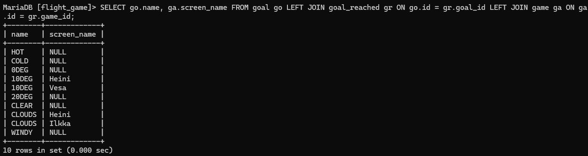

# Yhteen tauluun kohdistuvien kyselyiden harjoitukset

### Tehtävä 1
SELECT * FROM goal; 

### Tehtävä 2
select name from airport where iso_country = "FI";

### Tehtävä 3
SELECT name FROM airport WHERE iso_country = "FI" ORDER BY name ASC;

### Tehtävä 4
SELECT name, type FROM airport WHERE iso_country = "FI" ORDER BY type ASC, name ASC;

### Tehtävä 5
SELECT name FROM country WHERE name LIKE 'F%';

### Tehtävä 6
SELECT name FROM country WHERE name LIKE '%F%';

### Tehtävä 7
SELECT location FROM game WHERE screen_name = 'Vesa';

### Tehtävä 8
SELECT co2_consumed FROM game WHERE screen_name = 'Ilkka';

### Tehtävä 9
select distinct co2_budget from game;

# WHERE-osan liitosehto harjoitukset

### Tehtävä 1
SELECT c.name AS "country name", a.name AS "airport name" FROM country c JOIN airport a ON c.iso_country = a.iso_country WHERE a.iso_country = 'IS';

### Tehtävä 2
SELECT a.name AS "airport name" FROM airport a WHERE iso_country = 'FR' AND type = 'large_airport';

### Tehtävä 3
where c.continent = a.continent AND c.name = "Antarctica"

### Tehtävä 4
SELECT a.elevation_ft FROM airport a, game g WHERE a.gps_code = g.location AND g.screen_name = "Heini";

### Tehtävä 5
SELECT a.elevation_ft * 0.3048 AS elevation_m FROM airport a, game g WHERE a.gps_code = g.location AND g.screen_name = "Heini";

### Tehtävä 6
SELECT a.name FROM airport a, game g WHERE a.gps_code = g.location AND g.screen_name = "Ilkka";

### Tehtävä 7
SELECT c.name FROM airport a, country c, game g WHERE a.gps_code = g.location AND a.iso_country = c.iso_country AND c.iso_country = "GB" AND g.screen_name = "Ilkka";

### Tehtävä 8
select name from goal w, goal_reached gr, game ga where gr.game_id = ga.id and gr.goal_id = w.id and ga.screen_name = "Heini";

### Tehtävä 9
SELECT name FROM airport, game WHERE airport.ident = game.location AND game.screen_name = "Ilkka";

### Tehtävä 10
SELECT country.name FROM airport, game, country WHERE airport.ident = game.location AND airport.iso_country = country.iso_country AND country.name = "United Kingdom" AND game.screen_name = "Ilkka";

# Join harjoitukset

### Tehtävä 1
SELECT c.name as "country name", a.name AS "airport name" FROM country c INNER JOIN airport a ON c.iso_country = a.iso_country WHERE c.iso_country = "FI" AND a.scheduled_service = "yes";

### Tehtävä 2
SELECT g.screen_name, a.name FROM game g INNER JOIN airport a ON g.location = a.ident;

### Tehtävä 3
SELECT g.screen_name, c.name FROM game g INNER JOIN airport a ON g.location = a.ident INNER JOIN country c ON a.iso_country = c.iso_country;

### Tehtävä4
SELECT a.name, g.screen_name FROM airport a LEFT JOIN game g ON a.ident = g.location WHERE a.name LIKE "%Hels%" ORDER BY g.screen_name DESC;

### Tehtävä 5
SELECT go.name, ga.screen_name FROM goal go LEFT JOIN goal_reached gr ON go.id = gr.goal_id LEFT JOIN game ga ON ga.id = gr.game_id;

# Sisäkysely harjoitukset

### Tehtävä 1
SELECT name FROM country WHERE iso_country IN ( SELECT iso_country FROM airport WHERE name LIKE 'Satsuma%');

### Tehtävä 2
SELECT name FROM airport WHERE iso_country in (SELECT iso_country FROM country WHERE name = "Monaco");

### Tehtävä 3
SELECT screen_name FROM game WHERE id IN ( SELECT game_id FROM goal_reached WHERE goal_id = 7);

### Tehtävä 4
SELECT name FROM country WHERE iso_country NOT IN (SELECT iso_country FROM airport);

### Tehtävä 5
SELECT name FROM goal WHERE id NOT IN (SELECT goal_id FROM goal_reached WHERE game_id = 1);

